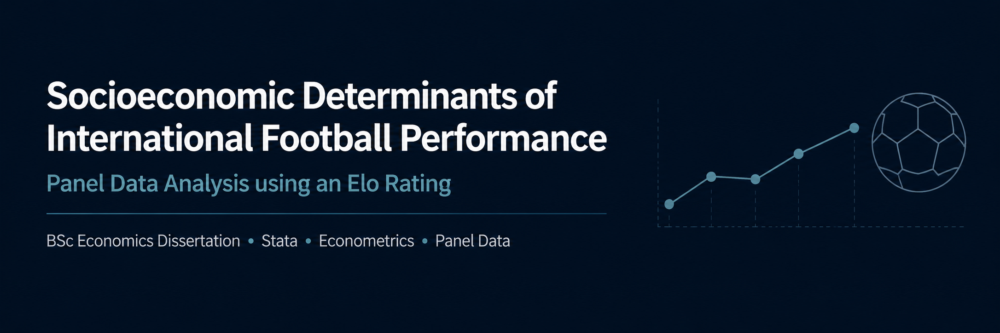
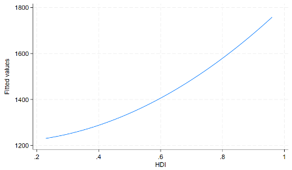
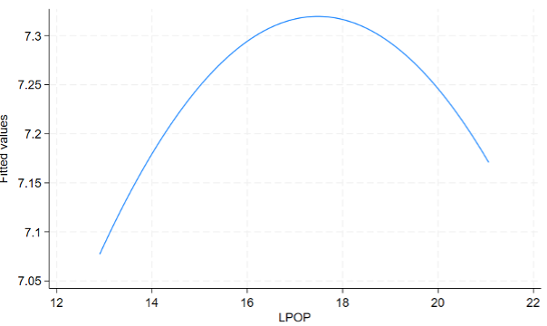
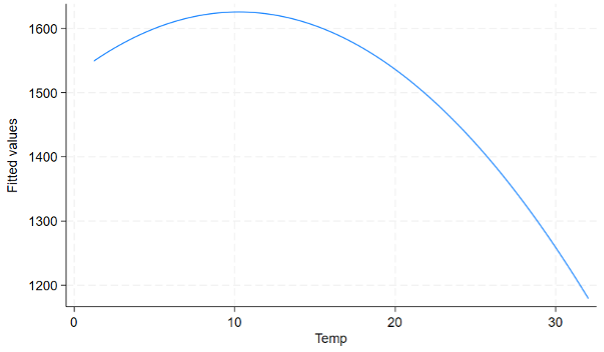

# Socioeconomic Determinants of International Football Performance

An econometric study investigating how socioeconomic, political and cultural factors influence the performance of men’s international football teams.

This project was completed as my undergraduate dissertation for a **BSc (Hons) Economics** degree and received a mark of **78%**.

The analysis uses panel data covering **147 countries between 1994 and 2018**, with international football performance measured using Elo ratings rather than conventional FIFA rankings. Ordinary least squares regression was used as the main estimation method, alongside a negative binomial model as a robustness check. :contentReference[oaicite:0]{index=0}

## Research Question

> What socioeconomic and political factors influence international football performance?

The study focuses on whether differences in development, population, political regime, conflict, climate and footballing tradition help explain why some national teams perform more successfully than others.

## Project Overview

International football performance is often explained through population size, wealth or sporting tradition. However, many previous studies rely on FIFA rankings or focus only on World Cup performance.

This study instead uses international football Elo ratings, which account for the strength of opponents, match outcomes and the relative importance of different competitions.

The analysis combines football performance data with economic, social and political indicators from several public sources.

## Dataset

The final panel dataset contains:

- **147 countries**
- **1994–2018**
- **3,650 observations**
- Annual international football Elo ratings
- Socioeconomic, political, climatic and football-related variables

The main variables used in the analysis were:

| Variable | Description |
|---|---|
| `ELO` | International football Elo rating |
| `RANK` | Annual Elo ranking |
| `HDI` | Human Development Index |
| `LPOP` | Natural logarithm of population |
| `DEMOC` | Democracy and autocracy score |
| `CONFLICT` | Whether a country experienced political violence or conflict |
| `TEMP14` | Difference between average temperature and 14°C |
| `PASTHOST` | Whether a country had previously hosted a World Cup |
| `MEMBER` | Years of FIFA membership |
| `HOST` | Whether a country hosted a major international tournament |

The dissertation includes full variable definitions, data sources and summary statistics. :contentReference[oaicite:1]{index=1}

## Methodology

The analysis was conducted in **Stata**.

The main model used ordinary least squares regression to estimate the relationship between Elo performance and the selected explanatory variables.

A second specification included an interaction between human development and political regime.

A negative binomial regression using Elo rank was then used as a robustness check.

### Statistical Methods

- Panel data analysis
- Ordinary least squares regression
- Negative binomial regression
- Interaction effects
- Robust standard errors
- Hypothesis testing
- Model specification testing
- Multicollinearity testing
- Heteroscedasticity testing
- Overdispersion testing

### Diagnostic Tests

The following diagnostic procedures were used:

- Ramsey RESET test
- Variance Inflation Factor test
- Breusch–Pagan test
- White’s test
- Likelihood-ratio test

The tests identified heteroscedasticity in the main OLS model, so robust standard errors were used. The likelihood-ratio test also supported the use of negative binomial regression instead of a Poisson model for the ranking specification. :contentReference[oaicite:2]{index=2}

## Main Findings

### Human development

Higher Human Development Index values were positively and significantly associated with stronger international football performance.

This suggests that countries with stronger health, education and living standards may be better positioned to develop football talent and supporting infrastructure.

### Population

Population had a positive relationship with performance, but the results suggested diminishing returns.

A larger talent pool can benefit a national team, although very large populations do not automatically produce strong football performance.

### Conflict

Countries experiencing conflict tended to perform worse internationally.

The conflict variable was statistically significant and may reflect reduced investment, weaker institutions and the diversion of resources away from sport.

### Climate

Greater deviations from a moderate average temperature were associated with weaker performance.

The findings suggested that slightly cooler average conditions may be more favourable than the 14°C benchmark commonly used in earlier research.

### Footballing tradition

Previous World Cup hosting and longer FIFA membership were both positively associated with performance.

These variables were used as proxies for footballing culture, institutional experience and long-term involvement in the sport.

### Political regime

Democracy was not statistically significant in the main OLS model.

However, the relationship became more complex when political regime was considered alongside human development and when Elo rank was used in the robustness model.

### Home advantage

Hosting a World Cup or regional tournament was not strongly significant in the main specification.

This suggests that modern international teams may be less affected by travel and unfamiliar playing conditions than expected.

The full results and interpretation are available in the dissertation. :contentReference[oaicite:3]{index=3}

## Key Regression Results

| Variable | Direction | Significance |
|---|---:|---:|
| Human Development Index | Positive | 1% |
| Population | Positive | 1% |
| Temperature deviation | Negative | 1% |
| Conflict | Negative | 5% |
| Democracy | Positive | Not significant |
| Previous World Cup host | Positive | 1% |
| FIFA membership duration | Positive | 1% |
| Current tournament host | Positive | 10% |

The main OLS model produced an R² value of approximately **0.27**. :contentReference[oaicite:4]{index=4}

## Figures

### Elo Rating and Human Development



### Elo Rating and Population



### Elo Rating and Temperature



## Tools and Skills

- Stata
- Econometrics
- Panel data
- OLS regression
- Negative binomial regression
- Statistical diagnostics
- Data collection
- Data cleaning
- Hypothesis testing
- Sports economics
- Academic research
- Technical writing

## Repository Structure

```text
international-football-performance-analysis/
├── README.md
├── dissertation/
│   └── socioeconomic-determinants-football-performance.pdf
├── figures/
│   ├── elo-vs-hdi.png
│   ├── elo-vs-population.png
│   └── elo-vs-temperature.png
├── data/
│   └── README.md
├── analysis/
│   └── README.md
├── assets/
│   └── banner.png
├── LICENSE
└── .gitignore
